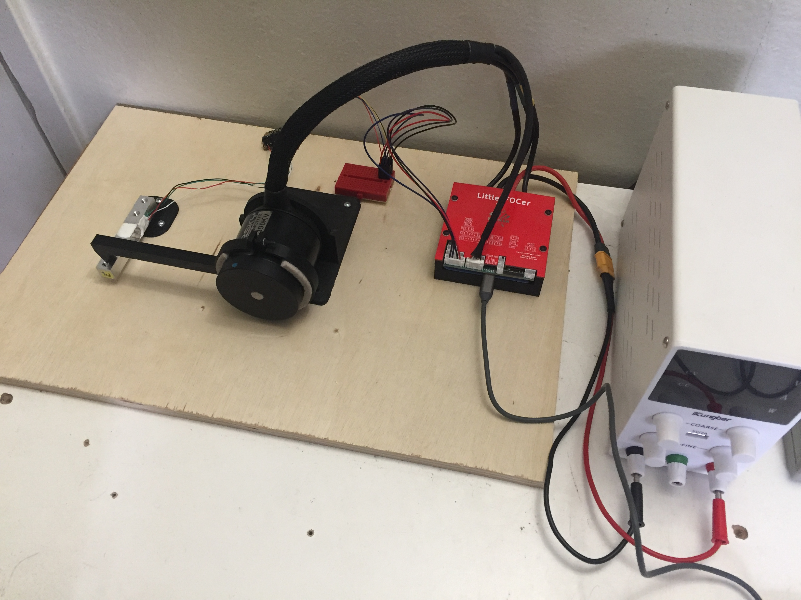

# Hall vs HFI Torque Experiment

Data collection performed on and around 28 Dec 2022.

This analysis measures the static torque constant for a motor in hall and HFI sensorless control.

Data is in the csv files.

A VESC tool 
[lisp script](./with-current-ramp.lisp) 
was used to ramp the motor current and take readings.

The controller is a Little FOCer V3.0 with VESC 6.0 firmware.

The power supply is a Kungber 30V power supply.